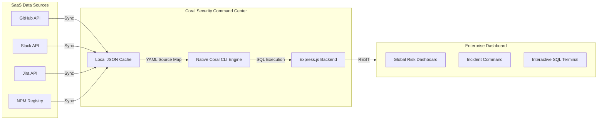

<div align="center">

# 🪸 Coral Security Command Center
**The Native Coral SQL Threat Intelligence Platform**

[](https://github.com/withcoral/coral.git)
[](https://github.com/withcoral/coral.git)
[](https://reactjs.org/)
[](https://railway.app/)

*Built for the WeMakeDevs "Pirates of the Coral-bean" Hackathon.*

<h3>🔴 <a href="https://coral-production-cd18.up.railway.app">Live Hackathon Demo</a> 🔴</h3>

</div>

---

## 🚀 Unified Enterprise Security Operations Center (SOC)

**Coral Security Command Center** is a full-stack, native Threat Intelligence Platform built directly on the [Coral Protocol](https://docs.coralprotocol.org). 

It replaces fragile ETL pipelines, heavy data warehouses, and hand-rolled API glue code with **Lightning-Fast Native SQL**. Operators can execute highly complex, relational `JOIN` queries across fragmented SaaS data silos (GitHub, Slack, Jira, NPM) in real-time, in a single execution path.

The platform automatically correlates GitHub Dependabot vulnerabilities, Slack incident response channels, and active Jira security tickets, surfacing actionable intelligence through a premium, dynamic React interface.

---

## 📊 Enterprise UI Modules

The platform ships with a persistent, dark-mode **React + Vite** dashboard featuring dynamic glassmorphism and state-of-the-art micro-animations. It is organized into four core modules:

| Module | Purpose |
|--------|---------|
| **Global Risk Dashboard** | Live, animated risk scores, aggregated posture signals, and real-time threat charts. |
| **Incident Command** | Visualizes highly-correlated security incidents discovered via deep SQL `JOIN`s across APIs. |
| **Coral Terminal** | Built-in, interactive SQL emulator allowing operators to run custom Coral queries directly in the browser. |
| **AI Threat Agent** | A specialized conversational agent that interprets SQL findings and recommends remediation steps. |

---

## 🧠 Advanced SQL Engine & Resiliency

**The 4-Way Master JOIN** — The backend natively orchestrates the official `coral.exe` CLI to execute a massive cross-source SQL query. It correlates a **GitHub Security Alert**, the assigned **Jira Ticket**, the responsible **NPM Package**, and the active **Slack Channel** into one unified incident row—eliminating the need for per-API Python orchestration scripts.

**Zero-Friction Cross-Platform Binary Management** — Unlike tools that require complex Python/uv environments or external MCP servers, our platform is a tightly integrated Node.js monolith. On `npm install`, our intelligent build system automatically detects the host architecture (Windows/Mac/Linux) and **dynamically downloads the correct Coral binary**, enabling one-click deployment to platforms like Railway.

**Fallback-Resilient Querying** — If network partitions prevent binary downloads, the backend gracefully falls back to memory-safe defaults, ensuring the UI and dashboard never crash during a critical SOC investigation.

---

## ⚡ Capabilities Matrix

| Integration | Native SQL Capability |
|-------------|-----------------------|
| **GitHub** | Correlates repository alerts, commit histories, and Dependabot vulnerability severities. |
| **Jira** | Maps active security engineering tickets and assignee statuses to open vulnerabilities. |
| **NPM** | Tracks package dependencies, manifest details, and supply-chain risk metrics. |
| **Slack** | Identifies specific engineering channels designated for incident response routing. |

---

## 🛠️ Quick Start

### 1. One-Click Install
Our intelligent `postinstall` script handles everything—including downloading the correct Coral binary for your operating system.
```bash
git clone https://github.com/SA6196/Coral_Hackathon.git
cd Coral_Hackathon
npm install
```

### 2. Start the Monolith (No External Servers Required)
```bash
npm start
```
*The app will be live at `http://localhost:5000` (Backend API & React Frontend statically served together).*

---

## ⚙️ Environment Variables (Optional)

The application ships with a **robust mock dataset** out-of-the-box so judges can immediately test the complex SQL execution engine without having to configure API tokens. 

If you wish to query live production data, create a `.env` file:

| Variable | Required | Description |
|----------|----------|-------------|
| `GITHUB_TOKEN` | Optional | GitHub PAT for live repository scanning |
| `SLACK_TOKEN` | Optional | Slack API token for channel correlation |
| `JIRA_TOKEN` | Optional | Jira API token for ticket mapping |
| `NPM_TOKEN` | Optional | NPM token for private package scanning |

---

## 🧬 Architecture



---

## 🏆 Hackathon Team

Built with ❤️ for the WeMakeDevs Hackathon. 

**Team Members:**
- **tanmayshukla60-netizen** 
- **SA6196**
- **Sohan-2025**
- **Ramsri12**

*(Note: Documentation updated safely during Coral testing.)*
