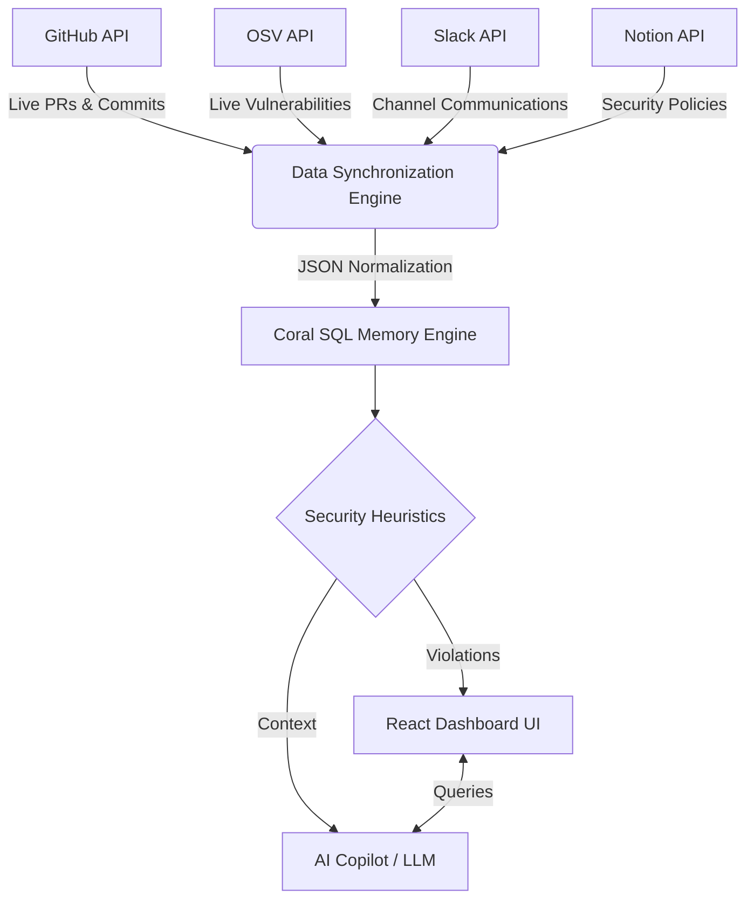

<div align="center">

# 🪸 Coral Security Command Center
**The Enterprise Threat Intelligence Platform of the Future**

[](https://reactjs.org/)
[](https://nodejs.org/)
[](https://vitejs.dev/)
[](https://railway.app/)

*Built to identify, analyze, and remediate internal threats before they hit production.*

</div>

---

## 🚀 Overview

**Coral** is an advanced Security Command Center that acts as the brain of your DevSecOps pipeline. By utilizing a proprietary in-memory SQL-like join engine, Coral ingests data streams from **GitHub (Commits & PRs)**, **Slack (Communications)**, **Notion (Company Policies)**, and the **OSV Database (Vulnerabilities)** to build a unified, multidimensional threat model of your engineering organization.

When a threat is detected, Coral doesn't just alert you. It spins up an **AI-powered SOC Analyst Copilot** equipped with complete context—giving security managers immediate containment playbooks, developer risk profiles, and 1-click remediation scripts.

---

## ✨Features

*   **Live Data Sync Engine**: Don't rely on mock data. Coral connects to live repositories via the GitHub API, cross-references dependencies with the Open Source Vulnerability (OSV) API, and pulls live Slack/Notion configurations dynamically. 
*   **Behavioral Developer Risk Scoring**: An advanced heuristic engine that scores developers based on the severity of their commits, policy violations, and historical behavior (e.g., hardcoding AWS secrets).
*   **In-Memory "Coral SQL" Engine**: Complex data joins across disparate systems (Git, Chat, Docs, Threat Intel) happen natively in-memory without needing an external data warehouse.
*   **RAG-Powered AI Copilot**: Uses Retrieval-Augmented Generation to allow managers to chat with their organization's security posture. Ask questions like *"Who introduced the highest number of critical bugs this week?"* and get contextual answers.
*   **Automated Containment**: One-click generation of Bash scripts to immediately lock down compromised developer accounts or roll back vulnerable deployments.

---

## 🧠 Architecture

Coral is built on a split architecture ensuring extreme performance and rapid integration. 



---

## 🛠️ Tech Stack

*   **Frontend:** React 18, Vite, Framer Motion (for hyper-smooth micro-interactions), Recharts (data visualization), Vanilla CSS (glassmorphism UI).
*   **Backend:** Node.js 20+, Express.js, Axios.
*   **External APIs:** GitHub REST API, OSV.dev, Slack Web API, Notion API.
*   **Deployment:** Fully configured for CI/CD via **Railway** (`package.json` engines enforced).

---

## 💻 Running Locally

You can spin up the entire Coral stack with a single command. 

### Prerequisites
*   Node.js >= 20.0.0
*   npm

### Installation

1. Clone the repository:
   ```bash
   git clone https://github.com/tanmayshukla518-max/Coral.git
   cd Coral
   ```

2. Install dependencies for both Frontend and Backend:
   ```bash
   npm run postinstall
   ```

3. Start the application:
   ```bash
   npm run build
   npm start
   ```

4. Open your browser to `http://localhost:5000`.

*(Note: In local development, you can also run `npm run dev` inside the `frontend` folder to get Hot Module Replacement on port 5173).*

---

## 🔑 Live Data Configuration

By default, Coral ships with a mock dataset so you can immediately see the UI. To unlock its full power and use **Live Data**, click the badges on the dashboard to enter your API tokens, then click the **⚡ Sync Live Data** button.

| Integration | Required Scope / Token | Where to get it |
| :--- | :--- | :--- |
| **GitHub** | Personal Access Token (`repo` scope) | [GitHub Settings](https://github.com/settings/tokens) |
| **OSV** | *Public API (No token required!)* | N/A |
| **Slack** | Bot OAuth Token (`channels:history`) | [Slack API](https://api.slack.com/apps) |
| **Notion** | Internal Integration Secret | [Notion Integrations](https://www.notion.so/my-integrations) |

---

## 🛡️ License
Built for the Hackathon. May your commits be secure and your deployments green.
